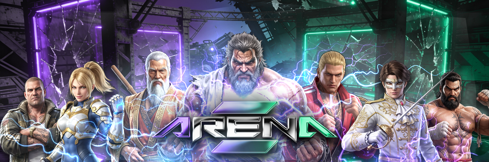
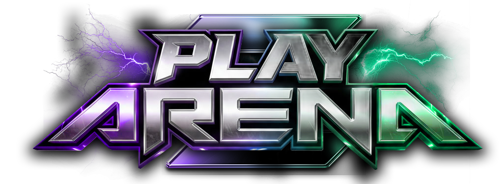

<div align="center">



<br />

**Provably Fair PvP Betting on Solana**

[Website](https://playarena.app) · [Documentation](https://docs.playarena.app) · [Twitter](https://twitter.com/PlayArenaApp)

<br />

[](LICENSE)
[](https://solana.com)
[]()
[](https://switchboard.xyz)

</div>

---

## Overview

Arena is a Web3 betting platform where players wager SOL on head-to-head battles between two fighters—**Purple** and **Green**. Each round runs for 3 minutes, with winners determined by verifiable on-chain randomness powered by Switchboard VRF.

<div align="center">
  <br />
  
  <br />
</div>

---

## Features

<table>
  <tr>
    <td><strong>Provably Fair</strong></td>
    <td>Tamper-proof outcomes via Switchboard VRF with full on-chain verification</td>
  </tr>
  <tr>
    <td><strong>Instant Settlement</strong></td>
    <td>Winners automatically receive SOL directly to their wallet</td>
  </tr>
  <tr>
    <td><strong>Deflationary Mechanics</strong></td>
    <td>8% of losing pools used for REN token buyback and burn</td>
  </tr>
  <tr>
    <td><strong>Multi-Wallet Support</strong></td>
    <td>Phantom, Trust, MetaMask, Solflare, Coinbase Wallet, Ledger, Torus</td>
  </tr>
  <tr>
    <td><strong>Real-Time Experience</strong></td>
    <td>WebSocket-powered live updates for bets, chat, and battle state</td>
  </tr>
</table>

---

## How It Works

<div align="center">

```
┌─────────────┐      ┌─────────────┐      ┌─────────────┐      ┌─────────────┐
│   WAITING   │ ───▶ │   ACTIVE    │ ───▶ │    BREAK    │ ───▶ │   SETTLED   │
└─────────────┘      └─────────────┘      └─────────────┘      └─────────────┘
       │                    │                    │                    │
       ▼                    ▼                    ▼                    ▼
  Awaiting bets        3-minute            VRF reveals          Auto-payouts
  on both sides         battle               winner            + new round
```

</div>

---

## Parameters

| | |
|:--|:--|
| **Network** | Solana Mainnet |
| **Minimum Bet** | 0.01 SOL |
| **Maximum Bet** | 10 SOL |
| **Round Duration** | 3 minutes |
| **Break Duration** | 30 seconds |

---

## Fee Structure

When a round concludes, the losing pool is distributed:

| Recipient | Allocation | Description |
|:--|:--:|:--|
| Winners | 90% | Proportional to bet size |
| REN Buyback & Burn | 8% | Deflationary token mechanism |
| Platform | 2% | Operational costs |

---

## Quick Start

1. **Install a Wallet** — [Phantom](https://phantom.app) recommended
2. **Visit Arena** — [playarena.app](https://playarena.app)
3. **Connect Wallet** — Sign the verification message
4. **Place Your Bet** — Choose Purple or Green
5. **Win** — Payouts are automatic

---

## Documentation

| Document | Description |
|:--|:--|
| [Getting Started](getting-started.md) | Wallet setup and placing your first bet |
| [Game Mechanics](how-it-works.md) | Round flow and battle system |
| [Tokenomics](tokenomics.md) | Fee structure and REN burn mechanics |
| [Provably Fair](provably-fair.md) | VRF verification and transparency |
| [FAQ](faq.md) | Common questions |

---

## Security

Arena implements enterprise-grade security measures:

| | |
|:--|:--|
| **Switchboard VRF** | Cryptographically secure, verifiable randomness |
| **On-Chain Verification** | All bets and payouts recorded on Solana |
| **Signature Authentication** | Wallet-based identity verification |
| **Rate Limiting** | Protection against spam and abuse |

> **Responsible Disclosure** — Found a vulnerability? See [SECURITY.md](SECURITY.md)

---

## Contributing

We welcome contributions. Please read our [Contributing Guidelines](CONTRIBUTING.md) before submitting a pull request.

---

<div align="center">

[Website](https://playarena.app) · [Twitter](https://twitter.com/PlayArenaApp) · [Documentation](https://docs.playarena.app)

<br />

<sub>Built on Solana</sub>

</div>
